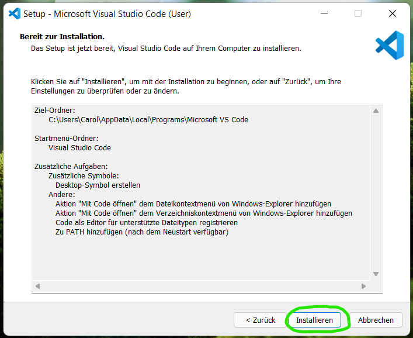
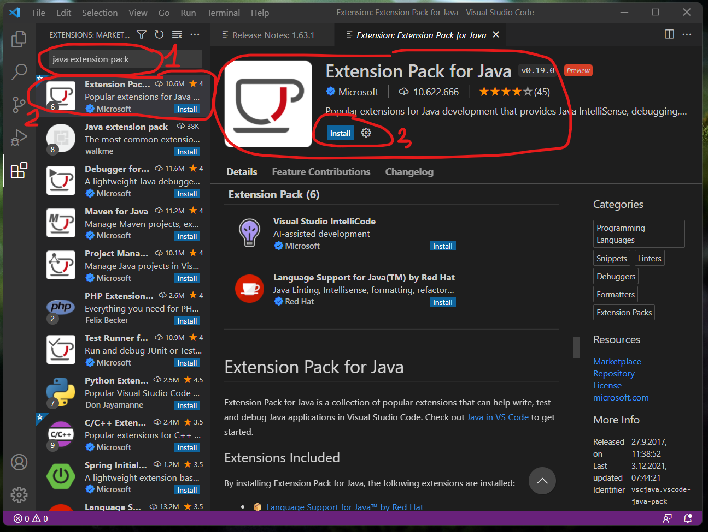

# Hochschule Düsseldorf, FB EI, Grundlagen der Informatik 4

## Course 00 - Setup

For the following courses you need to install

1) **Java 17** 
2) **VsCode** 
3) **Maven**

on your computer.

These tools are already installed on the computers in the HSD lab, you ***do not*** need to install them there!

##### If you are working with your ***own*** computer, the installation process is shown below: 

<details>
<summary>WINDOWS</summary>

- Winget for Windows 10 users: [LINK](https://www.microsoft.com/en-us/p/app-installer/9nblggh4nns1#activetab=pivot:overviewtab) (winget is installed in Windows 11 by default)   
- Java Open JDK 17
  - Either via installer: [Adoptium Open JDK installer](https://adoptium.net/)
  - Or via winget (system-wide by default):
      ```powershell
      winget install EclipseAdoptium.Temurin.17.JDK
      ```
- Visual Studio Code
  - Either via installer: [Visual Studio Code Installer](https://code.visualstudio.com/)
    1) Download the vscode installer [from the official website.
      ](https://code.visualstudio.com/)

      

    2) Locate the vscode installer on your computer (for example in Downloads)
       
       

    3) Run the vscode installer
       
       

       

       

       

       

       
  - Or with winget system-wide:  
    ```
    winget install Microsoft.VisualStudioCode --scope machine
    ```
  - Or with winget as a user-only installation:  
    ```powershell
    winget install Microsoft.VisualStudioCode
    ```
- [VSCode Java extension pack](https://marketplace.visualstudio.com/items?itemName=vscjava.vscode-java-pack)
- [VSCode Spring Boot extension pack](https://marketplace.visualstudio.com/items?itemName=Pivotal.vscode-boot-dev-pack)
- Gluon Scene Builder
  - Either via installer: [Gluon Scene Builder Installer](https://gluonhq.com/products/scene-builder)
  - Or with winget (user only):
      ```powershell
      winget install Gluon.SceneBuilder
      ```
- [Maven](https://maven.apache.org/install.html)
  - open powershell as administrator (right-click: open as administrator) and run:
      ```powershell
      Set-ExecutionPolicy Bypass -Scope Process -Force; [System.Net.ServicePointManager]::SecurityProtocol = [System.Net.ServicePointManager]::SecurityProtocol -bor 3072; iex ((New-Object System.Net.WebClient).DownloadString('https://community.chocolatey.org/install.ps1'))
      ```
  - Once the installation is completed, close the Powershell (Admin) or Terminal (Admin) and open it again and run:        
      ```powershell
      choco install maven
      ```
</details>

<details>
<summary>MACOS</summary>

- Homebrew (If wanted)
  - If wanted you can use homebrew to complete the following installation steps. [Homebrew](https://brew.sh) is a unofficial package manager for macOS, which should help you with installing new software on your system. To get started with homebrew just paste the following command inside your terminal window:
    ```
    /bin/bash -c "$(curl -fsSL https://raw.githubusercontent.com/Homebrew/install/HEAD/install.sh)"
    ```

- Java Open JDK 17
  - Either via installer: [Adoptium Open JDK installer](https://adoptium.net/)
  - Or via brew:
    ```
    brew install --cask temurin
    ```
- Visual Studio Code
  - Either via installer: [Visual Studio Code Installer](https://code.visualstudio.com/)
    1. Download the vscode App [from the official website.](https://code.visualstudio.com/)
    

    2. Install the app on your system. Simply drag and drop the downloaded `*.app` file into your Applications folder.
    
  - Or via brew:  
    ```
    brew install --cask visual-studio-code
    ```
- [VSCode Java extension pack](https://marketplace.visualstudio.com/items?itemName=vscjava.vscode-java-pack)
- [VSCode Spring Boot extension pack](https://marketplace.visualstudio.com/items?itemName=Pivotal.vscode-boot-dev-pack)
- Gluon Scene Builder
  - Either via installer: [Gluon Scene Builder Installer](https://gluonhq.com/products/scene-builder)
  - Or via brew:
    ```
    brew install --cask scenebuilder
    ```
- Maven
  - Either manually using these setup instructions: [Maven - Installing](https://maven.apache.org/install.html)
  - Or via brew:
    ```
    brew install maven
    ```
</details>


<details>
<summary>UBUNTU</summary>

- Java Open JDK 17
  ```bash
  sudo apt install openjdk-17-jdk
  ```
- Visual Studio Code
  - Either via installer: [Visual Studio Code Installer](https://code.visualstudio.com/)
  - Or via snap:  
    ```bash
    sudo snap install code --classic
    ```
- [VSCode Java extension pack](https://marketplace.visualstudio.com/items?itemName=vscjava.vscode-java-pack)
- [VSCode Spring Boot extension pack](https://marketplace.visualstudio.com/items?itemName=Pivotal.vscode-boot-dev-pack)
- Gluon Scene Builder
  - via installer: [Gluon Scene Builder Installer](https://gluonhq.com/products/scene-builder)
  - or via terminal:
    ```bash
    wget https://download2.gluonhq.com/scenebuilder/17.0.0/install/linux/SceneBuilder-17.0.0.deb
    sudo dpkg -i SceneBuilder-17.0.0.deb
    ```
- [Maven](https://maven.apache.org/install.html) 
  ```bash
  sudo apt install maven
  ```
</details>

<br>

### Setup VsCode (do not skip this step!)

1) Click on the "Extension" Icon in the left panel
   
   

2) search for `java extension pack` in the search field click on the first entry (NOTE: check that the distributor is MICROSOFT and no-one else) and click on the `Install` button to installer the extension pack. Wait until all extensions are installed.
   
   
   
   
