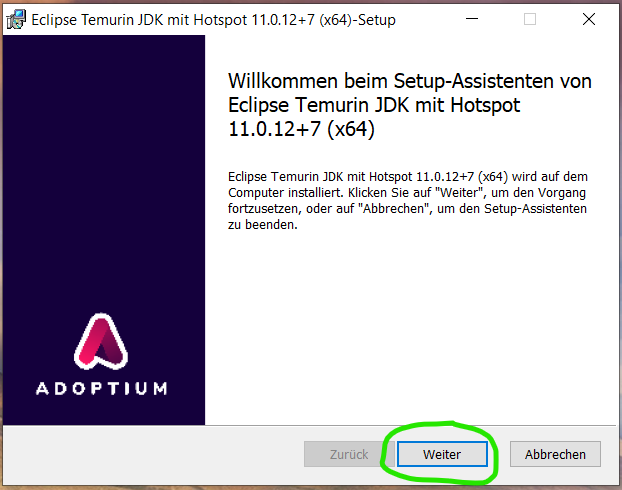
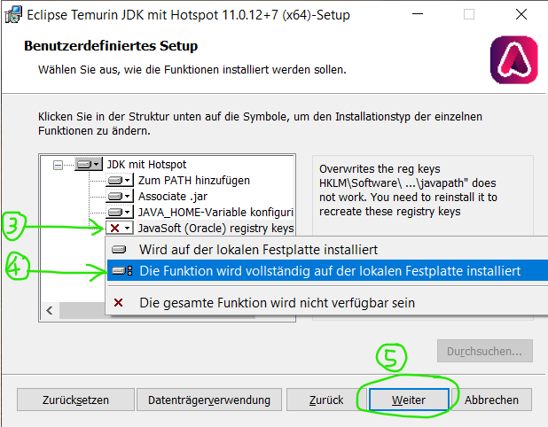
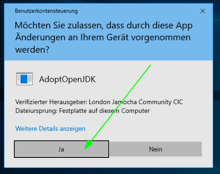
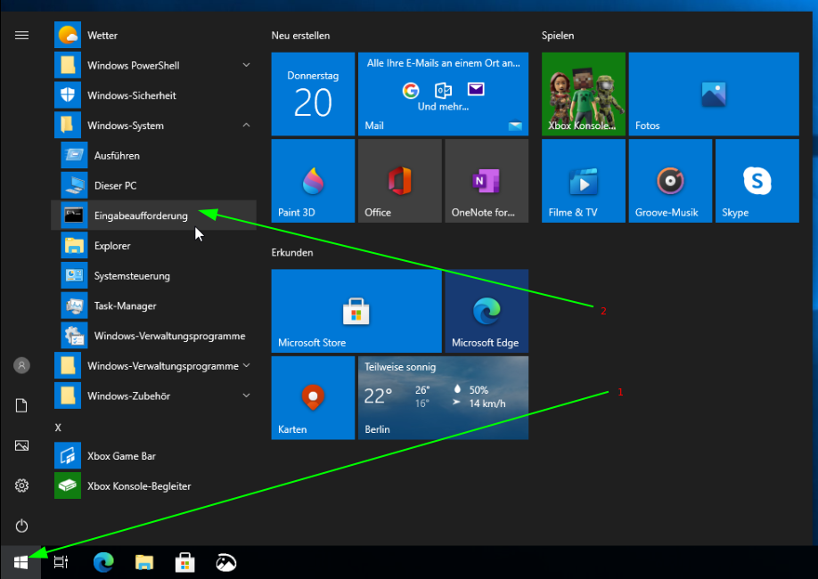
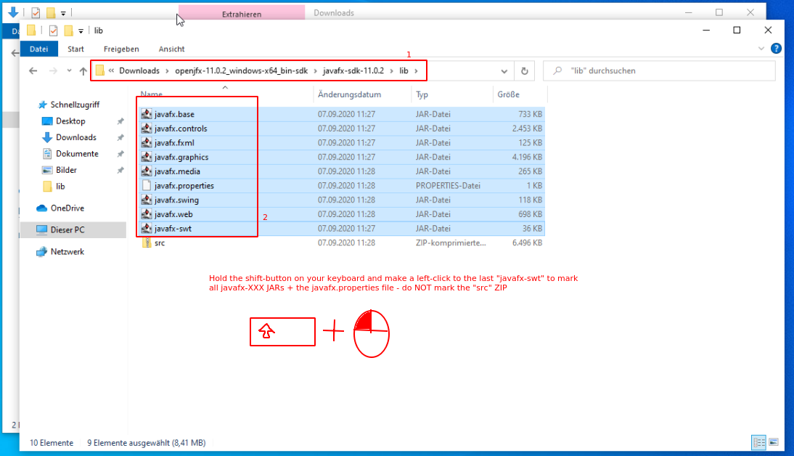
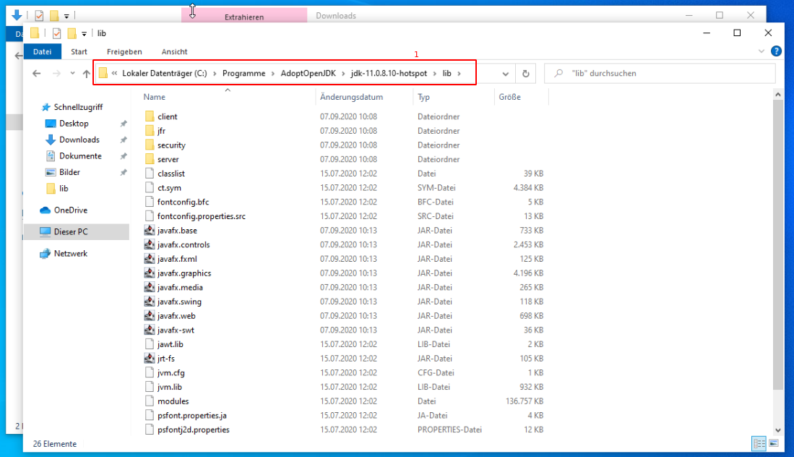
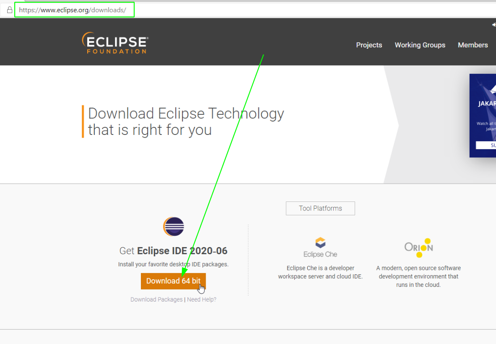
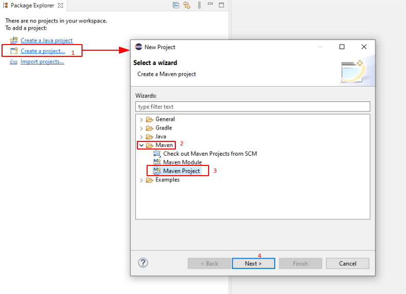
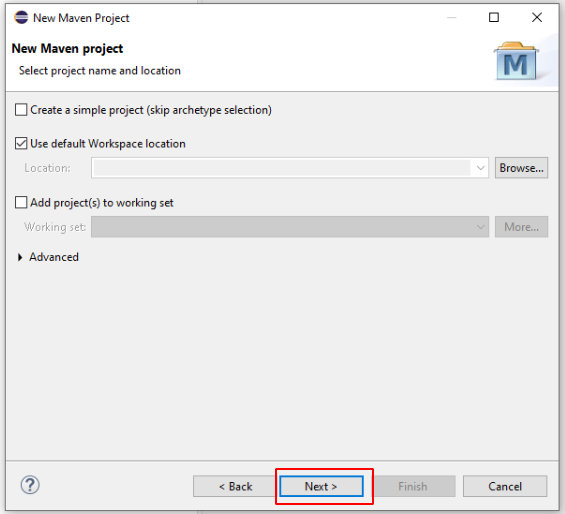

- [Software Engineering 1](#software-engineering-1)
  - [Java & Eclipse Tutorial](#java--eclipse-tutorial)
    - [Install Java](#install-java)
      - [Install Java on Windows](#install-java-on-windows)
      - [Install Java on MacOS](#install-java-on-macos)
      - [Install Java on Ubuntu Linux](#install-java-on-ubuntu-linux)
    - [Install JavaFX](#install-javafx)
  - [Install JavaFX on Windows](#install-javafx-on-windows)
  - [Install JavaFX on MacOS](#install-javafx-on-macos)
  - [Install JavaFX on Ubuntu Linux](#install-javafx-on-ubuntu-linux)
    - [Install Eclipse](#install-eclipse)
      - [Install Eclipse on Windows](#install-eclipse-on-windows)
      - [Install Eclipse on MacOS](#install-eclipse-on-macos)
      - [Install Eclipse on Ubuntu Linux](#install-eclipse-on-ubuntu-linux)
  - [Course 01](#course-01)
    - [Topics](#topics)
    - [Tasks](#tasks)
      - [Simple "Hello-Java-App"](#simple-hello-java-app)
      - [Hello World Eclipse tutorial](#hello-world-eclipse-tutorial)
      - [JavaFX graphical user interface app](#javafx-graphical-user-interface-app)
  - [Course 02](#course-02)
    - [Learning goals](#learning-goals)
    - [Tasks](#tasks-1)
  - [Course 03 (Currently German only)](#course-03-currently-german-only)
    - [Topic:](#topic)
    - [Tasks:](#tasks-2)
  - [Course 04](#course-04)
    - [Topic](#topic-1)
    - [Tasks](#tasks-3)

# Software Engineering 1

## Java & Eclipse Tutorial

### Install Java

#### Install Java on Windows

1. Open https://adoptopenjdk.net  in your browser
2. Download and run the adopt open JDK installation wizard


3. Click through the adopt open jdk wizard:  







3. Verify that java has been installed successfully by running the command `java -version` in your Windows command line interface:



#### Install Java on MacOS

WIP

#### Install Java on Ubuntu Linux

1. Open a terminal with **CTRL + ALT + T**
2. Run the following command:

    ```bash
    sudo apt install default-jdk
    ```

### Install JavaFX

#### Install JavaFX on Windows

1. Open your browser and navigate to https://gluonhq.com/products/javafx/
2. Click on the green Download-Button for JavaFX Windows SDK

    

3. Navigate to the directory where you've downloaded the ZIP to

    

4. Right click and extract

    

5. Select a directory to extract

    

6. Navigate to the directory where you've extracted the ZIP-archive to and click your way to the **lib-directory**
7. Hold the shift button, then left click to select all files except the **src** ZIP - do NOT select the **src** ZIP

    

   
7. Check that all files except the src zip are marked and then copy them with either right-click->copy or pressing CTRL + C

    

8. Navigate to `C:\Program Files\AdoptOpenJDK\jdk-11.0.8.10-hotspot\lib` (the version number might be different by the time you work through this tutorial) and paste your copied files into this **lib** directory by either righ-click->paste or pressing CTRL + V on your keyboard

    

#### Install JavaFX on MacOS

WIP

#### Install JavaFX on Ubuntu Linux

1. Open a new terminal (CTRL + ALT + T)
2. run the following command to install javafx

    ```bash
    sudo apt install openjfx
    ```

### Install Eclipse

#### Install Eclipse on Windows

1. Download the Eclipse installer from [the official Eclipse website](https://www.eclipse.org/downloads/packages/installer) for Windows

    

2. Run the Eclipse installer from your Windows Explorer:

    

2. Click through the installer to install Eclipse:

    

    

    
    
    


#### Install Eclipse on MacOS

WIP

#### Install Eclipse on Ubuntu Linux

If you like you can also run the Eclipse installer wizard on Ubuntu linux from https://www.eclipse.org/downloads/packages/installer or ...

1. Open a terminal with **CTRL + ALT + T**
2. Run the following command:

    ```bash
    sudo snap install eclipse --classic --edge
    ```

## Course 01

### Topics

1. Create, compile and run a simple "Hello World" java application.
2. Create, compile and run a java application with a simple JavaFX graphical user interface with Eclipse.

### Tasks

#### Simple "Hello-Java-App"

1. Open a simple text editor (Windows Notepad, Ubuntu Gedit or MacOs TextEdit) enter the following code and save it as ```Hello.java``` to your desired location:
    ```java
    public class Hello {
        public static void main(String args[]) {
            System.out.println("Hello Java");
        }
    }
    ```
2. Open a command line interface (Windows: Windows-Key + R -> Type `Cmd.exe`, press enter, Ubuntu: CTRL + SHIFT + T, MacOs: search for `Terminal`) and navigate to the location where you saved your Java Code with:
    ```bash
    cd PATH_TO_YOU_FILE
    ```
3. Type ```javac Hello.java``` and press enter
4. Now the java code has been compiled to ```Hello.class``` which you can run from within your terminal with:
    ```java
    java Hello
    ```

#### Hello World Eclipse tutorial

1. Open Eclipse
2. Click on `Create a Hello World application`

    

3. Follow the guide on the right side of your screen to create the Hello World application and run it.

#### JavaFX graphical user interface app

1. Click on `Create a project...` (**not** `Create a Java project`!!!), expand the the directory `Maven` and select `Maven project` - then click on `Next >`

    

2. Leave everything as it is and click on `Next`

    

3. Click in the search filter, type `javafx`, scroll to the end and select `javafx-archetype-simple` from `org.openjfx`

    

4. Enter the Group id `org.hsd.inflab`, Artifact Id `se1c1`

    

5. Open the package `src/main/java`, right-click `App.java` -> hover on `Run as` click on `Java Application`

    

6. Replace the the ***whole*** code in `App.java` with the following code to create a window with a button that prints `Hello Java!` to the terminal when you click it:
    ```java
    package org.hsd.inflab.se1c1;

    import javafx.application.Application;
    import javafx.scene.Scene;
    import javafx.scene.control.Button;
    import javafx.scene.layout.BorderPane;
    import javafx.stage.Stage;

    public class App extends Application {

        @Override
        public void start(Stage stage) {

            BorderPane borderPane = new BorderPane();        

            String message = "Hello Java!";
            Button button = new Button("Say: " + message);
            button.setOnAction((event) -> {
                System.out.println(message);
            });

            borderPane.setCenter(button);
            
            Scene scene = new Scene(borderPane, 400, 400);
            stage.setScene(scene);
            stage.show();
        }

        public static void main(String[] args) {
            launch(args);
        }

    }
    ```

7. Run your `App.java` again
   


## Course 02

### Learning goals

1. Transfer your C knowledge to Java.
2. Implement the Algorithms ```FourOutOfSixCoins``` and ```VariableCoins```

### Tasks

1. Create the ***Java*** project `se1c2`
2. Create the application ```FourOutOfSixCoins```:
    - There are 6 given coins
    - Print out each possible combination
    - Print out the total number of combinations in the terminal
3. Create the application ```VariableCoins```:
   - Set global integer variables ```MAX``` and ```SUB```
   - There are ```MAX``` given coins
   - Print out every combination of ```SUB``` coins
   - Print out the total number of combinations in the terminal

## Course 03 (Currently German only)

### Topic:
Einstieg in die Objektorientierung: Die Klassen Kfz und Lkw werden erstellt, wobei die
Grundprinzipien der Objektorientierung sukzessive einfließen. Dies bedeutet, dass wir mit
einer "schlechten" Klasse KfzV0 anfangen und diese ständig verbessern, bis wir schließlich
eine "schöne" Klasse Kfz erhalten.
Hierzu werden im Folgenden zwei Arten von Klassen erstellt. KfzV0, Kfz und Lkw sollen zur
Instanziierung von Objekten dienen und lediglich Attribute besitzen und Methoden zur
Verfügung stellen.
Die Demo-Klassen sollen genutzt werden, um einzelne Instanzen der Kfz Klassen zu
erzeugen. Diese sollen eine main-Methode enthalten und somit ausführbar sein.

### Tasks:
1. Erstellen Sie das neue Java Projekt `se1c3`.
2. Erstellen Sie sukzessive die Klassen KfzV0, Kfz und Lkw:
3. Implementieren Sie die Klasse KfzV0 mit den öffentlichen Integer-Attributen
sitze und tankInhalt und dem öffentlichen Float-Attribut verbrauch.
4. Implementieren Sie das Programm KfzDemo.java mit einer main-Methode:
   - Die Instanz minivan wird von der Klasse KfzV0 erzeugt.
   - Die Attribute werden mit sitze = 6, tankInhalt = 70, verbrauch = 14 initialisiert.
   - Die mögliche Reichweite bei vollem Tank wird ausgerechnet und mit
   System.out.println ausgegeben.
5. Erstellen Sie ausgehend von KfzDemo.java die Klasse ZweiKfz.java:
   - Zusätzlich zur minivan Instanz wird eine Instanz sportwagen von der Klasse KfzV0 erzeugt.
   - Die Attribute von sportwagen werden mit sitze = 2, tankInhalt = 45, verbrauch = 11 initialisiert.
   - Die mögliche Reichweite von sportwagen bei vollem Tank wird ausgerechnet und mittels System.out.println ausgegeben.
6. Erweitern Sie die Klasse KfzV0 um die Methode reichweite(), die die Reichweite als Rückgabewert liefert.
7. Erstellen Sie die Klasse ReturnDemo.java:
   - Die Ausgabe der Reichweite erfolgt in der main-Methode, wobei die Methode
   reichweite() genutzt wird.
8. Die Klasse KfzV0 wird um die Methode spritVerbrauch(int km) erweitert.
   - Die Methode hat als Eingabeparameter eine Entfernung in Kilometern.
   - Sie berechnet den entsprechenden Spritverbrauch für die Entfernung.
   - Der Spritverbrauch wird als float-Ergebnis zurückgegeben.
9. Erstellen Sie ausgehend von ReturnDemo.java die Klasse SpritDemo.java:
   - Die Methode spritVerbrauch wird in der main-Methode für die Entfernung 252 km aufgerufen und die Ergebnisse für die beiden Instanzen ausgegeben.
10. Erstellen Sie ausgehend von KfzV0.java die Klasse Kfz. Die neue Klasse Kfz wird um den Konstruktor Kfz(int sitze, int tankInhalt, float verbrauch) erweitert. Zusätzlich werden alle Attribute auf privat gesetzt.
11. Erstellen Sie ausgehend von SpritDemo.java die Klasse KonstruktorDemo.java:
    - Die Attribute werden über den Konstruktor Kfz initialisiert.
12.  Die Klasse Lkw wird von Kfz abgeleitet (Vererbung):
    - Sie hat die beiden zusätzlichen Attribute int ladeFlaeche und boolean hatAnhaenger.
    - Der Konstruktor Lkw initialisiert alle Attribute.
    - Die Lkw-Methode spritVerbrauch addiert immer einen Liter zum errechneten Verbrauch hinzu.
13. Implementieren Sie das Programm LkwDemo.java mit:
    - Einer Instanz sportWagen der Klasse Kfz und einer Instanz magirus der Klasse
    Lkw.
    - Die magirus-Instanz hat die gleichen Attribute wie die sportwagen-Instanz (nur
    zur Demo).
    - Weisen Sie der zusätzlichen Kfz-Variable kfz (keine Instanziierung)
    nacheinander sportWagen und magirus zu und geben Sie jeweils den Verbrauch auf 252 km aus.
    
## Course 04

### Topic

Graphical user interface (GUI) visualizing a lottery drawing.

### Tasks

1. Create the Maven project ```se1c4``` by using the archetype `javafx-archetype-simple` from `org.openjfx`
2. Replace the Code in `App.java` and create a GUI which consists of 6 `TextField`s and one "Draw" `Button`. Fill the `TextField`s with random numbers between 1 and 49 via ```Math.random()```.
3. Extend the application with the following features:
    - No number is drawn more than 1 time
    - All numbers are sorted ascending from left to right

