# Software Engineering 1

## Setup your development environment: Java 17, Eclipse and vscode Tutorial

For the following courses you need to have

1) **Java 17** installed on your computer
2) **Eclipse** installed on your computer (alternatively vscode + maven, but for beginners we recommend Eclipse)

<details>
<summary> CLICK TO VIEW THE SETUP TUTORIAL </summary>

### Install Java 17

**Disclaimer: the exact Java 17 version number may be higher than the version number in the screenshots - but it needs to be Java 17, not 11, not 8 or 14 or higher**

#### Install Java 17 on Windows

1. Open https://adoptium.net/  in your browser
2. Download the installer

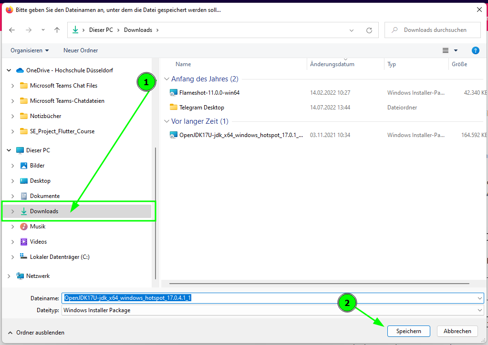
3. and start the installer
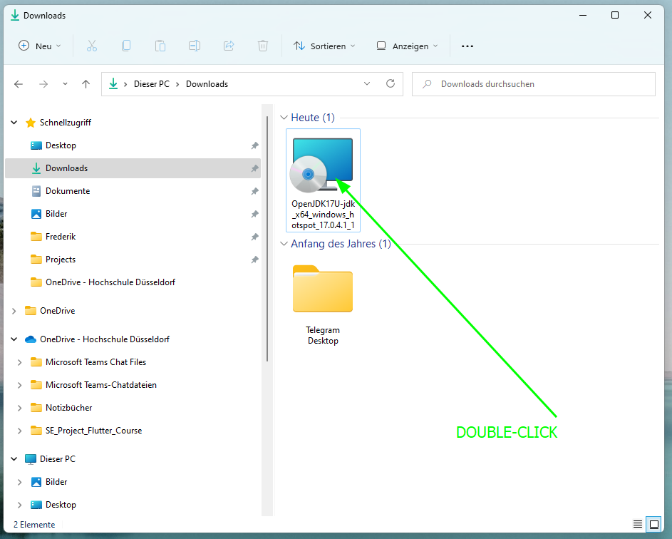

    ... sometimes you need to click "OK" for the installtion warning

    

4. Click through the adoptium open JDK wizard:  

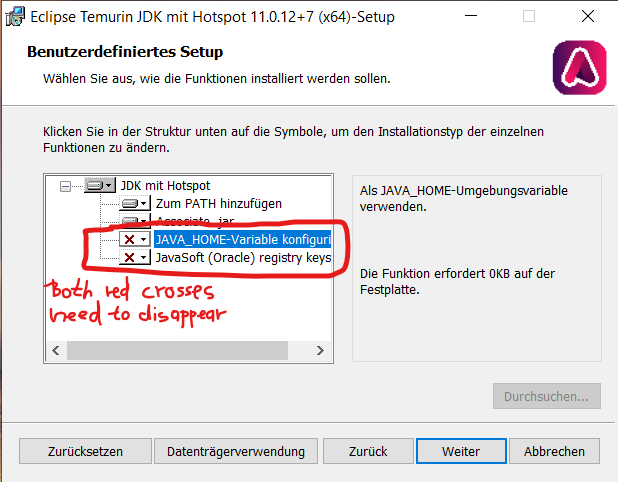


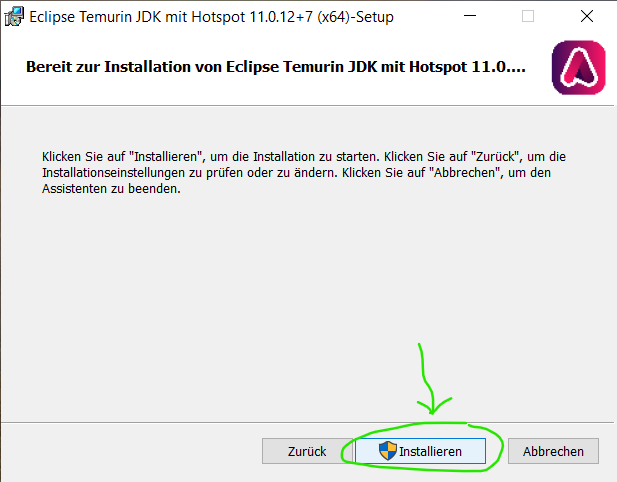
(the name might have changed to "Adoptium Open JDK")


5. Verify that java has been installed successfully by running the command `java --version` in your Windows command line interface, the exact version may be different at the time you run this command:


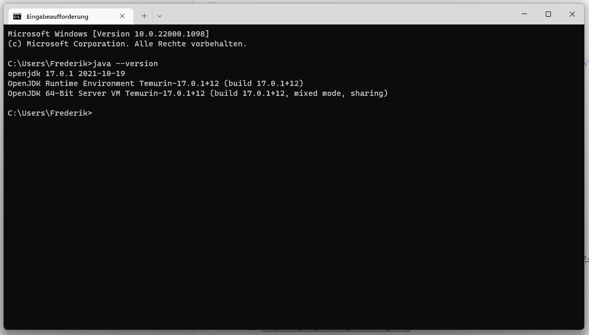

#### Install Java 17 on MacOS

1. Open https://adoptium.net/  in your browser
2. Download and run the adoptium open JDK 17 installation wizard


3. Verify that java has been installed successfully by running the command `java -version` in your MacOS **Terminal** command line interface:
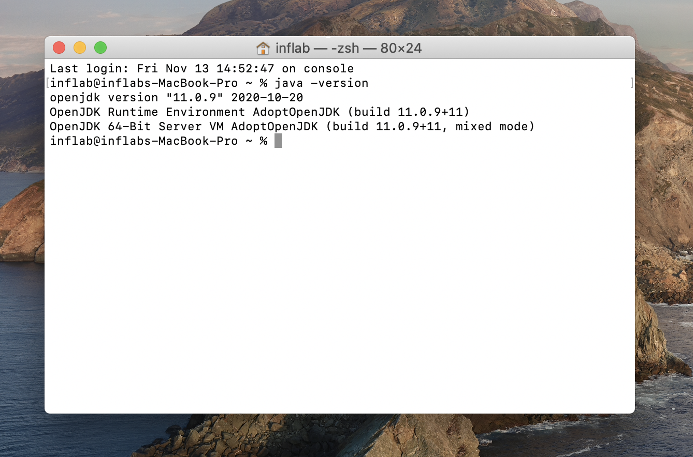

#### Install Java 17 on Ubuntu Linux

1. Open a terminal with **CTRL + ALT + T**
2. Run the following command:

    ```bash
    sudo apt install openjdk-17-jdk
    ```

### Install Eclipse

#### Install Eclipse on Windows

1. Download the Eclipse installer from [the official Eclipse website](https://www.eclipse.org/downloads/packages/installer) for Windows

    

2. Run the Eclipse installer from your Windows Explorer:

    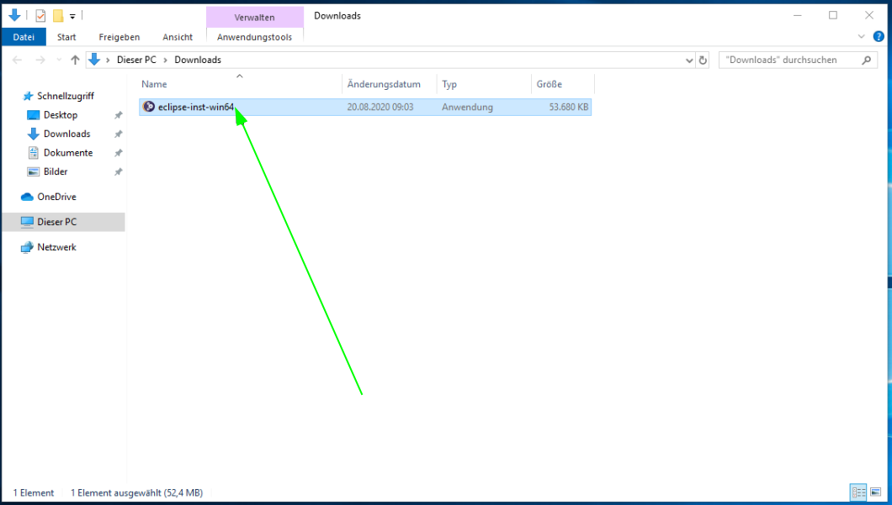

2. Click through the installer to install Eclipse:

    

    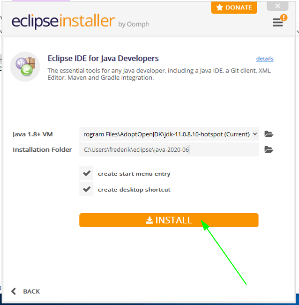

    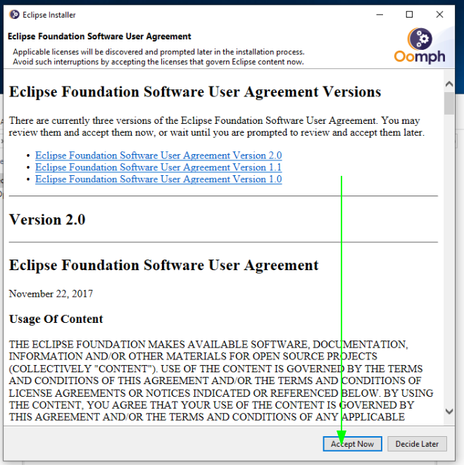
    
    


#### Install Eclipse on MacOS

1. Download the Eclipse installer from [the official Eclipse website](https://www.eclipse.org/downloads/) for MacOs
   
    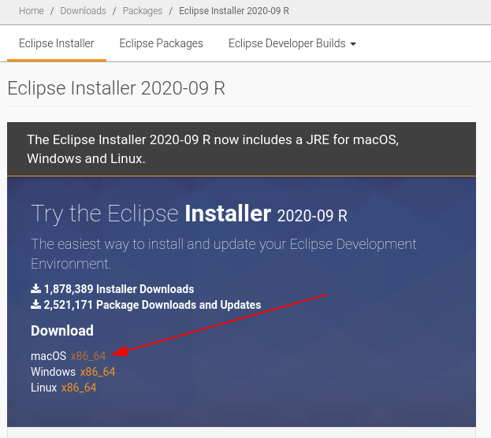

2. Open the Eclipse .dmg from your downloads

    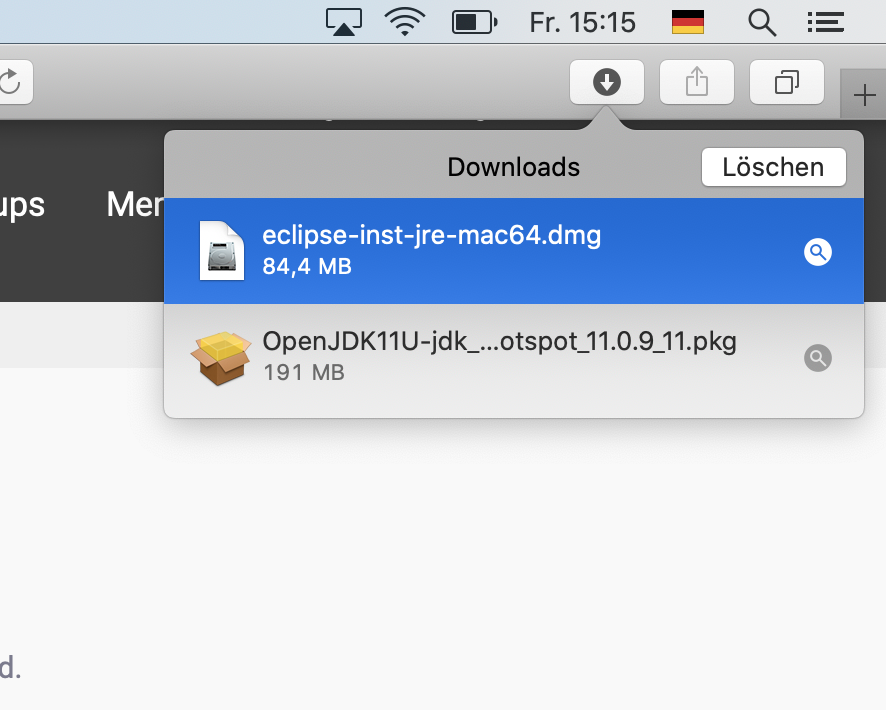

3. Confirm opening

    

4. Click on **Eclipse IDE for Java Developers**
    
    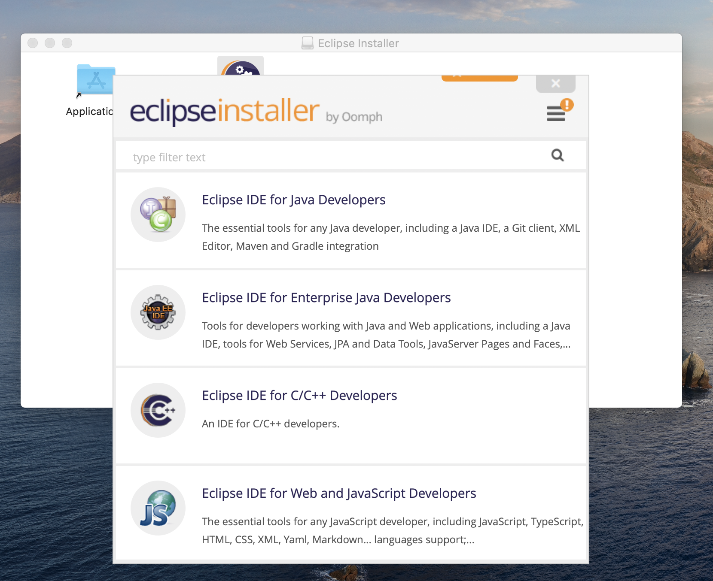

5. Follow the installer to finish installation
    
    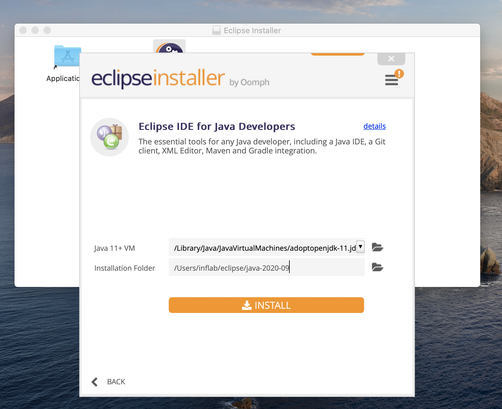

#### Install Eclipse on Ubuntu Linux

If you like you can also run the Eclipse installer wizard on Ubuntu linux from https://www.eclipse.org/downloads/packages/installer or ...

1. Open a terminal with **CTRL + ALT + T**
2. Run the following command:

    ```bash
    sudo snap install eclipse --classic --edge
    ```

### Install Visual Studio Code (vscode)

**IMPORTANT**: for Software Engineering **1** we recommend to use Eclipse, even though vscode is a much faster and more modern IDE/editor. However if you insist on using it, here is how to install it.

#### Windows

1) Download the vscode installer [from the official website.
  ](https://code.visualstudio.com/)

  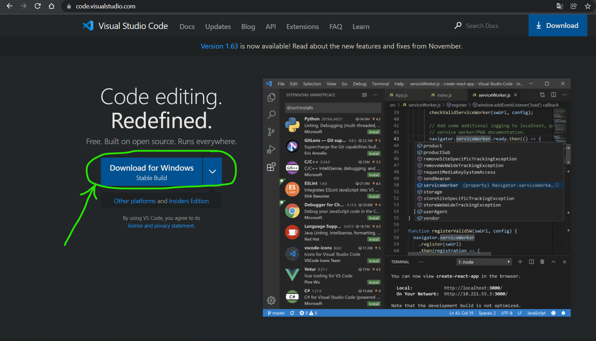

2) Locate the vscode installer on your computer (for example in Downloads)
   
   

3) Run the vscode installer
   
   

   

   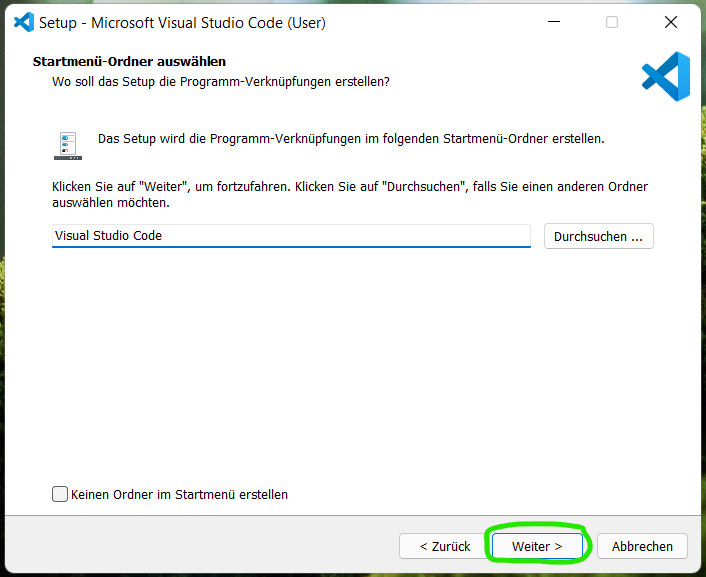

   

   

   

#### MacOS

##### Install via Installer

1. Download the vscode App [from the official website.
  ](https://code.visualstudio.com/)
 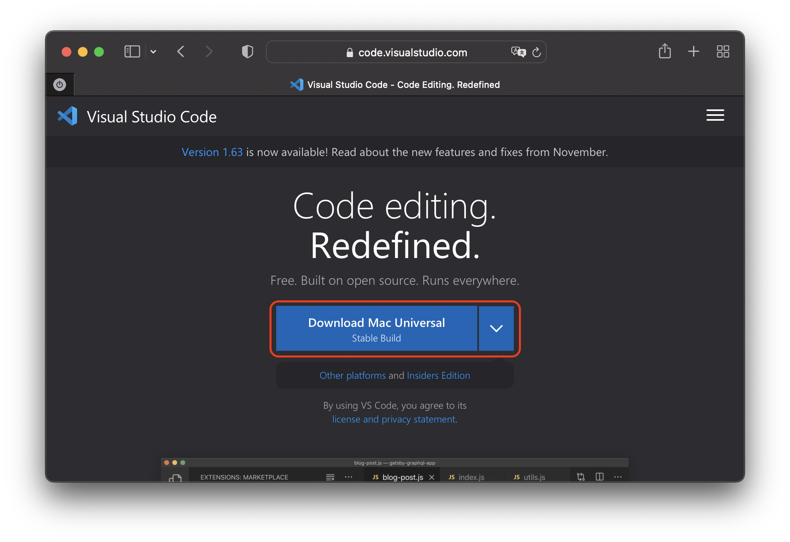

2. Install the app on your system. Simply drag and drop the downloaded `*.app` file into your Applications folder.
 

##### Install using Homebrew (for the advanced user)

[Homebrew](https://brew.sh/) is an **unofficial**, free and open-source package manager for macOS. Once Homebrew is installed inside your terminal, go ahead and run the following command:

```sh
brew install --cask visual-studio-code
```

#### Ubuntu

Open a new terminal with ```CTRL + SHIFT + T``` and run the following command to instal vscode:

```bash
sudo snap install code --classic
```

### Setup vscode

1) Click on the "Extension" Icon in the left panel
   
   

2) search for `java extension pack` in the search field click on the first entry (NOTE: check that the distributor is MICROSOFT and no-one else) and click on the `Install` button to installer the extension pack. Wait until all extensions are installed.
   
   
   
   

3) (Optional) search for `spring boot extension pack` in the search field click on the first entry (NOTE: check that the distributor is PIVOTAL and no-one else) and click on the `Install` button to installer the extension pack. Wait until all extensions are installed.
   
   


### How-to use vscode for Java development

#### Create a simple java project


#### Create a maven project


</details>

______

**ATTENTION:** When you are inside the HSD laboratory room safe ALL your work on the `H:\` drive!!!

## Course 01

<details>
<summary> MacOS Users only - CLICK TO EXPAND </summary>

Please make sure to follow these steps to "downgrade" your TextEdit to save simple java files:

- on the menu bar on the top left corner of your screen, click on TextEdit, then Preferences.
- In the New Document tab, change the document format to Plain Text under the Format section. Uncheck the Smart quotes box under the Options section towards the bottom of the preference window.
- Switch to the Open and Save tab. Change the Opening files and Saving files to Unicode (UTF-8).
- Close the TextEdit application and re-open it. Open a new document.

</details>

### Task overview

1. Create, compile and run a simple "Hello World" java application.
2. Use the Eclipse "Hello World tutorial" to get used to Eclipse *Java* Projects.
3. Create, compile and run a java application with a simple JavaFX graphical user interface with Eclipse via a *Maven* Project

### Tasks

#### Task 1 - Simple "Hello-Java-App"

1. Let your file explorer show file extensions to safe files with the correct `.java` file extension:

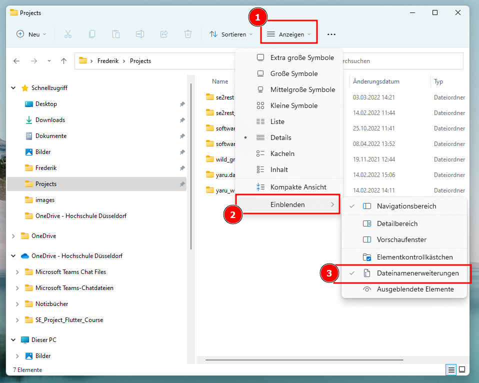

2. Open a simple text editor (Windows Notepad, Ubuntu Gedit or MacOs TextEdit) enter the following code and save it as ```Hello.java``` to your desired location:
    ```java
    public class Hello {
        public static void main(String args[]) {
            System.out.println("Hello Java");
        }
    }
    ```
3. Open a command line interface (Windows: Windows-Key + R -> Type `Cmd.exe`, press enter, Ubuntu: CTRL + SHIFT + T, MacOs: search for `Terminal`) and navigate to the location where you saved your Java Code with:
    ```bash
    cd PATH_TO_YOU_FILE
    ```

    NOTE: For Windows drives like `C:` or `H:` you just enter...

    ```
    H:
    ```
    **without the `cd` command**

    ... to change to this location.

4. Type ```javac Hello.java``` and press enter
5. Now the java code has been compiled to ```Hello.class``` which you can run from within your terminal with:
    ```java
    java Hello
    ```

#### Task 2 - Hello World Eclipse tutorial

1. Open Eclipse
2. Click on `Tutorials` -> `Create a Hello World application`

    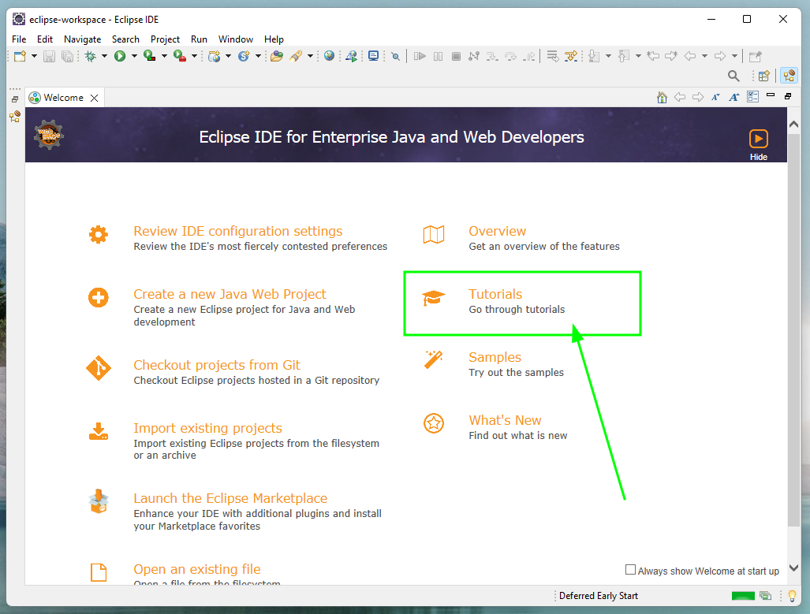
    

3. Follow the guide on the right side of your screen to create the Hello World application and run it.

**ATTENTION!!!**

In the following frame, click on ***Don't Create***, to skip the module description.

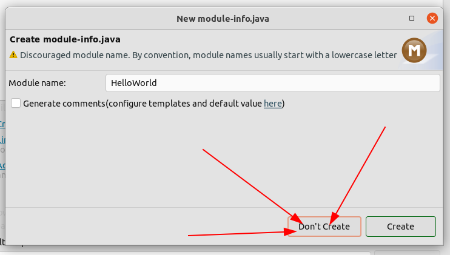

#### Task 3 - JavaFX graphical user interface app

1. Click on `Create a project...` (**not** `Create a Java project`!!!), expand the the directory `Maven` and select `Maven project` - then click on `Next >`

    

2. Leave everything as it is and click on `Next`

    

3. Click in the search filter, type `javafx`, scroll to the end and select `javafx-archetype-simple` from `org.openjfx`

    

4. Enter the Group id `org.hsd.inflab`, Artifact Id `se1c1`

    

5. Open the package `src/main/java`, right-click `App.java` -> hover on `Run as` click on `Java Application`

    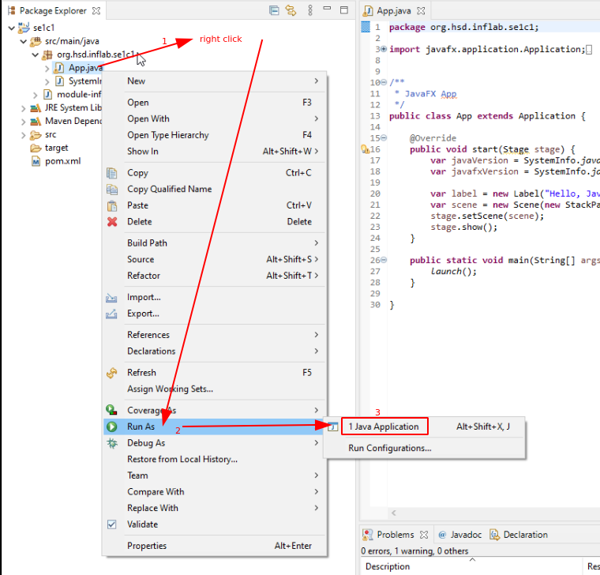

6. Replace the the ***whole*** code in `App.java` with the following code to create a window with a button that prints `Hello Java!` to the terminal when you click it:
    ```java
    package org.hsd.inflab.se1c1;

    import javafx.application.Application;
    import javafx.scene.Scene;
    import javafx.scene.control.Button;
    import javafx.scene.layout.BorderPane;
    import javafx.stage.Stage;

    public class App extends Application {

        @Override
        public void start(Stage stage) {

            BorderPane borderPane = new BorderPane();        

            String message = "Hello Java!";
            Button button = new Button("Say: " + message);
            button.setOnAction((event) -> {
                System.out.println(message);
            });

            borderPane.setCenter(button);
            
            Scene scene = new Scene(borderPane, 400, 400);
            stage.setScene(scene);
            stage.show();
        }

        public static void main(String[] args) {
            launch(args);
        }

    }
    ```

7. Run your `App.java` again
   


## Course 02

### Tasks

1. Create the ***Java*** project `se1c2`
2. Inside the project `se1c2` create the new class `FourOutOfSixCoins` and within implement the following:
    - There are four coins
    - Each coin has a value between 1 and 6
    - Print out each possible combination in the terminal
    - Print out the total number of combinations in the terminal
3. (OPTIONAL) Inside the project `se1c2` create the application ```VariableCoins``` and within implement the following:
   - Set global integer variables ```AMOUNT_OF_COINS``` and ```COIN_MAX_VALUE```
   - There are ```AMOUNT_OF_COINS``` coins
   - Each coin has a value between 1 and ```COIN_MAX_VALUE```
   - Print out each possible combination in the terminal
   - Print out the total number of combinations in the terminal

**Permutations do not have to be included in the calculation!**

Example output:
```
...
[4, 2, 3, 1]
[1, 2, 3, 5]
[6, 2, 1, 3]
[1, 2, 5, 4]
...
...
...
```

## Course 03 (Currently German only)

### Topic: "Einstieg in die Objektorientierung"
Die Klassen Kfz und Lkw werden erstellt, wobei die
Grundprinzipien der Objektorientierung sukzessive einfließen. Dies bedeutet, dass wir mit
einer "schlechten" Klasse KfzV0 anfangen und diese ständig verbessern, bis wir schließlich
eine "schöne" Klasse Kfz erhalten.
Hierzu werden im Folgenden zwei Arten von Klassen erstellt. KfzV0, Kfz und Lkw sollen zur
Instanziierung von Objekten dienen und lediglich Attribute besitzen und Methoden zur
Verfügung stellen.
Die Demo-Klassen sollen genutzt werden, um einzelne Instanzen der Kfz Klassen zu
erzeugen. Diese sollen eine main-Methode enthalten und somit ausführbar sein.

### Tasks:
1. Erstellen Sie das neue **Java Projekt** `se1c3`.
2. Erstellen Sie sukzessive (nacheinander) die Klassen ``KfzV0``, ``Kfz`` und ``Lkw``:
   - Implementieren Sie die Klasse ``KfzV0`` mit den öffentlichen Integer-Attributen
   ``sitze`` und ``tankInhalt`` und dem öffentlichen Float-Attribut `verbrauch`.
3. Implementieren Sie das Programm KfzDemo.java mit einer main-Methode:
   - Das Objekt ``minivan`` wird von der Klasse ``KfzV0`` erzeugt.
   - Die Attribute werden mit ``sitze = 6``, ``tankInhalt = 70``, ``verbrauch = 14`` initialisiert.
   - Die mögliche Reichweite bei vollem Tank wird ausgerechnet und mit
   ``System.out.println`` ausgegeben.
4. Erstellen Sie ausgehend von ``KfzDemo.java`` die Klasse ``ZweiKfz.java``:
   - Zusätzlich zum ``minivan`` Objekt wird ein Objekt ``sportwagen`` von der Klasse ``KfzV0`` erzeugt.
   - Die Attribute von ``sportwagen`` werden mit ``sitze = 2``, ``tankInhalt = 45``, ``verbrauch = 11`` initialisiert.
   - Die mögliche Reichweite von ``sportwagen`` bei vollem Tank wird ausgerechnet und mittels ``System.out.println`` ausgegeben.
5. Erweitern Sie die Klasse ``KfzV0`` um die Methode ``reichweite()``, die die Reichweite als Rückgabewert liefert.
6. Erstellen Sie ausgehend von `ZweiKfz.java` die Klasse ``ReturnDemo.java``:
   - Die Ausgabe der Reichweite erfolgt in der main-Methode, wobei die Methode
   reichweite() genutzt wird.
7. Die Klasse ``KfzV0`` wird um die Methode `spritVerbrauch(int km)` erweitert.
   - Die Methode hat als Eingabeparameter eine Entfernung in Kilometern.
   - Sie berechnet den entsprechenden Spritverbrauch für die Entfernung.
   - Der Spritverbrauch wird als float-Ergebnis zurückgegeben.
8. Erstellen Sie ausgehend von ``ReturnDemo.java`` die Klasse ``SpritDemo.java``:
   - Die Methode spritVerbrauch wird in der main-Methode für die Entfernung 252 km aufgerufen und die Ergebnisse für die beiden Instanzen ausgegeben.
9.  Erstellen Sie ausgehend von ``KfzV0.java`` die Klasse ``Kfz``. Die neue Klasse ``Kfz`` wird um die Konstruktor-Methode ``Kfz(int sitze, int tankInhalt, float verbrauch)`` erweitert. Zusätzlich werden alle Attribute auf ``private`` gesetzt.
10. Erstellen Sie ausgehend von ``SpritDemo.java`` die Klasse ``KonstruktorDemo.java``:
    - Die Attribute werden über den Konstruktor ``Kfz`` initialisiert.
11.  Die Klasse Lkw wird von ``Kfz`` abgeleitet (Vererbung):
    - Sie hat die beiden zusätzlichen Attribute ``int ladeFlaeche`` und ``boolean hatAnhaenger``.
    - Der Konstruktor ``Lkw`` initialisiert alle Attribute.
    - Die Lkw-Methode ``spritVerbrauch`` addiert immer einen Liter zum errechneten Verbrauch hinzu.
12. Implementieren Sie das Programm ``LkwDemo.java`` mit:
    - Einem Objekt ``sportWagen`` der Klasse ``Kfz`` und ein Objekt ``magirus`` der Klasse
    ``Lkw``.
    - Das magirus-Objekt hat die gleichen Attribute wie das sportwagen-Objekt (nur
    zur Demo).
    - Weisen Sie der zusätzlichen Referenz-Variable ``kfz`` der Klasse Kfz (keine Instanziierung)
    nacheinander ``sportWagen`` und ``magirus`` zu und geben Sie jeweils den Verbrauch auf 252 km aus.
    
## Course 04

### Topic

Java FX Graphical user interface (GUI) visualizing a lottery drawing.

### Tasks

1. Create the Maven project ```se1c4``` by using the archetype `javafx-archetype-simple` from `org.openjfx` to create a **JAVA FX** (not Swing!) appliction
2. Extend the Code in `App.java` and create a GUI which consists of 6 [TextField](https://openjfx.io/javadoc/17/javafx.controls/javafx/scene/control/TextField.html)'s and one "Draw" [Button](https://openjfx.io/javadoc/17/javafx.controls/javafx/scene/control/Button.htmll). Fill the `TextField`s with random numbers between 1 and 49 via ```Math.random()```.
3. Extend the application with the following features:
    - No number is drawn more than 1 time
    - All numbers are sorted ascending from left to right


